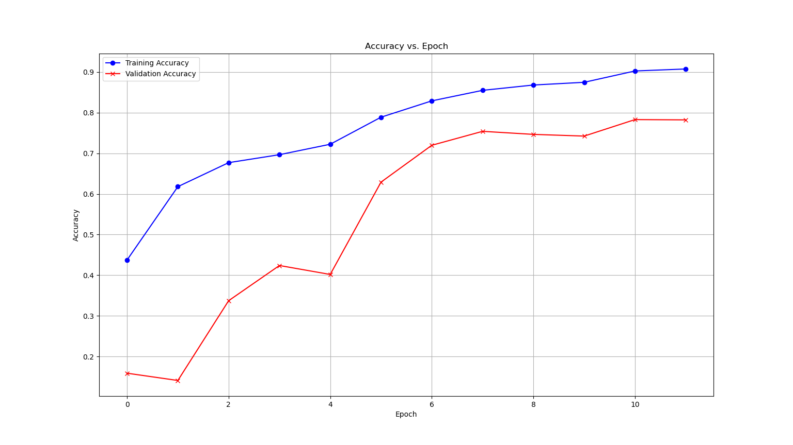
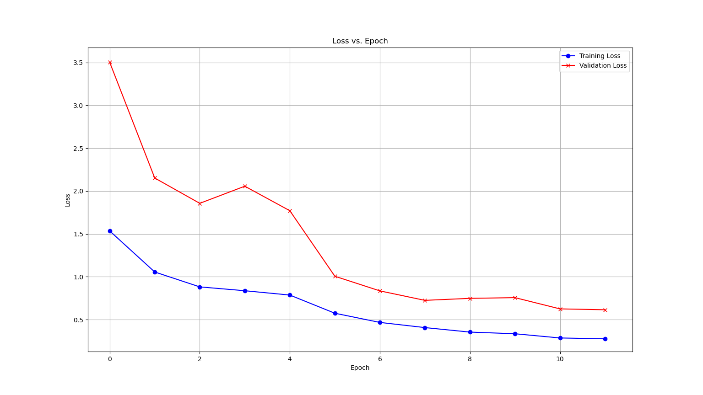

# Introduction
Breast cancer is a prevalent global cancer, causing significant mortality. In the United States alone, there were 284,200 cases and 44,130 deaths in 2021 [1]. Promptly and accurately identifying cancerous and benign breast tissues is vital for effective treatment. While histopathological data analyzed by trained medical professionals is currently used for classification, machine-learning techniques using medical imaging data, such as mammograms and ultrasound images, have shown promise in diagnosing breast cancer [2]. These techniques primarily distinguish between benign and malignant tumors, but further classification is necessary due to distinct subtypes that influence prognosis and treatment planning. The challenge lies in accurately identifying each subtype due to the complexity and variability of breast tissue characteristics, often relying on cellular measurements [3].

# Problem Statement
Despite advancements in breast cancer classification, there remains a challenge to achieving high accuracy and reliability. The motivation behind this project is to develop an ML model that accurately classifies breast tissues as cancerous or benign but also classifies subtypes of each category. We also aim to compare classification performances between raw unannotated breast mammogram images and annotated images. The motivation behind this comparison is to check if ML models perform as well when we remove human annotations, giving us an idea of the current feasibility of automating breast cancer detection from mammogram images without human interference.

# Dataset
We are utilizing two datasets, one with unannotated mammogram images and the other with feature annotations of the mammogram images.
<ol>
  <li> Image Dataset: Publicly available Breast Cancer Histopathological Database [4]. The dataset is composed of 9,109 microscopic images of breast tumor tissue using different magnifying factors (40X, 100X, 200X, and 400X). It contains 2,480 benign and 5,429 malignant samples (700X460 pixels, 3-channel RGB, 8-bit depth). The benign and malignant samples are further classified into Adenosis, Fibroadenoma, Tubular Adenoma, Phyllodes Tumor for benign samples and Ductal Carcinoma, Lobular Carcinoma, Mucinous Carcinoma (Colloid), and Papillary Carcinoma for malignant samples.</li>
<li>Feature Annotated Dataset: Publicly available Wisconsin Breast Cancer Diagnostic dataset [5]. The dataset contains 357 samples labeled as "benign" and 212 samples labeled as "malignant." The dataset consists of features computed from digitized fine needle aspirate (FNA) images of breast masses, specifically describing cell nucleus characteristics. These features include mean radius, texture, perimeter, area, smoothness, compactness, concavity, concave points, symmetry, and fractal dimension. </li>
</ol>

# Methods
We have divided our analysis into parts, first using the image dataset and second using the feature annotated dataset.
<ol>
  <li>Image Dataset</li>
  <ol>
      <li>Data Cleaning and Preprocessing</li>
      <li>Feature Extraction</li>
      <li>Unsupervised</li>
      <li>Support Vector Machine Classification</li>
      <li>Random Forest Classification</li> 
  </ol>
  <li>Feature Annotated Dataset</li>
  <ol>
      <li>Unsupervised</li>
      <li>K-means Clustering</li>
      <li>Supervised</li>
      <li>Logistic Regression</li>
      <li>Random Forest</li>
      <li>Support Vector Machine Classification</li>
      <li>Neural Networks</li>
    </ol>
</ol>

<!---
We aim to use unsupervised learning for exploratory analysis of our problem space and supervised learning for classification.
<ol type='a'> 
<li> K-means and hierarchical clustering can identify common attributes within each disease subtype, aiding feature design and understanding. </li>
<li> Dimensionality reduction methods like PCA can improve tractability and feature prioritization. </li>
<li> With the potential for high dimensionality, a multi-class application of SVMs can help find optimal hyperplanes separating subtypes. </li>
<li> Decision trees can extract explicit if-then rules on feature values, making them suitable for cancer prediction. Random forests can lead to improved robustness &mdash; feature importances are valuable for interpretability. </li>
<li> With image data, convolutional/feed-forward neural networks could be viable to extract complex, non-linear relationships. </li>
</ol> >

# Potential Results and Discussion
In this project, we expect to achieve several outcomes. Firstly, we will evaluate and compare our candidate machine learning models based on metrics like accuracy, precision/recall, F1 score, AUC-ROC, and the confusion matrix. This analysis will help us identify the most effective model for breast cancer classification. Given the healthcare context of our problem, the false-positive rate is also a key consideration.

Secondly, we aim to attain high accuracy and reliability in distinguishing between cancerous and benign breast tissue to aid in timely diagnosis. We plan to calculate interpretability metrics like Shapley values to determine the most influential features, providing insights for medical professionals and researchers. We acknowledge the possibility of limitations and will explore additional techniques such as data augmentation, ensemble methods, multimodal classification, or advanced deep-learning architectures if applicable.
--->

# Results and Discussion
## Image Dataset
### Data Cleaning and Preprocessing

The original dataset has been divided into five parts for cross-validation to ensure there are no overlaps between the training and testing data. We use the second fold data for this analysis since it has the highest number of training images.
      

#### Class Imbalance
The training data for fold 2 had highly imbalanced data, with around 32% (1,323) of images tagged as 'benign' and the rest 68% (2,860) as 'malignant'. There were two possible ways to go about handling the class imbalance, either augmenting more images for the benign class or downsampling the malignant class. Although augmentation is an interesting challenge, we decided to go forward with downsampling the data, to save on computational resources and reduce run times of models.

### Feature Extraction
As discussed before, one of the drawbacks of this dataset is the lack of human annotations of the mammogram images. In order to make the images more interpretable to our ML models, we perform feature selection to highlight the contours and differentiate the background of these images. We focus on extracting the contours since they are the most distinguishable features between benign and malignant tumors [6] and can act as a proxy for annotated data like "nuclei radius", "concavity," and more. 
We use Niblack and Sauvola thresholding for our feature selection method since they are useful for images where the background is not uniform, which is one of the major characteristics of breast mammogram images.

Here we show some examples of Niblack and Sauvola thresholding for both benign and malignant tumors.

#### Benign Tumor

#### Malignant Tumor

As we can see here, malignant tumors often lose the contour definitions that can be observed in benign tissues.

The outputs from thresholding are good candidates for a pipeline using image-based convolutional neural networks. However, in order to visualize our dataset we also attempted to extract aggregate features and applied unsupervised learning on the decreased feature set.

### Image Descriptor Features

We used a patch-based image feature extraction technique [7] to extract features with the aim of unsupervised exploration. For this study we restrict the dataset to 40x magnification.
The paper proposes selecting patches of the RGB slide image - we selected 25 patches per image with a patch size of 100x100. For each patch, we compute the Sobel kernel convolution over the grayscale image as an approximation of the gradient of the image - both in x- and y- directions. Combined with the original RGB intensities, this results in a feature vector of size 5 for each pixel of the patch. The regional covariance descriptor (RCD) of the patch is then computed as the covariance of the patch. This holds information about contours/edges.

In order to capture color information, we create a histogram over each of the color channels, with 256 bins each. The product of this matrix with its tranpose results in another feature vector of size 3x3, capturing global color information.
These features are flattened together to provide 34 (25 + 9) features per patch. To get the features for an image, we take the mean of its patch features.

To visualize the data, we apply PCA and reduce the number of features to 3. We can observe that there is not much obvious class similarity - apart from a small group of malignant samples with high feature values, the two classes have significant overlap.

This results in poor clustering results - K-means had an accuracy of ~63% when distinguishing between a set number of clusters (2, one benign and one malignant). The result was similar when using all 34 features, or with the PCA-reduced feature set of 3.

The main reason for the lack of separation can be attributed to the location of the malignant portions of the slide. As the source in [7] describes, expert annotation was required to identify which part of the image is actually malignant - this helped them design their bag-based SVM approach, which encoded positional information about the patch within the image. It may be possible to circumvent this problem by using a CNN on the filtered images, due to its ability to extract image features and derive complex non-linear relationships.

### Support Vector Machine Classification

The above visualizations demonstrate SVMs’ poor ability of handling image-based data. It isn’t suitable for such data for the following reason.

First, when using raw image data, each pixel in the image becomes a feature. This significantly increases the dimensionality of the feature space, which can lead to worse performance due to the curse of dimensionality.

Second, SVMs do not inherently handle translation, scale, and rotation invariance. This means that if an object (like a tumor) appears in different places in the image (translation), at different sizes (scale), or at different orientations (rotation), the SVM may not recognize it as the same object.

Last, SVMs do not automatically learn features from raw data. In image processing tasks, feature engineering (e.g., creating features that describe textures, shapes, or colors in the image) can help improve an SVM's performance. Without this kind of feature engineering, SVMs may not perform well on raw image data.

   
### Random Forest Classification
We employed the Random Forest algorithm for image classification. Random Forest is an ensemble learning method that combines multiple decision trees to make predictions. Each tree is trained on a random subset of the data and features, and the final prediction is determined by a majority vote of the individual trees.
On the first pass, using the data after feature selection and with default parameters, we obtain a classification accuracy of 60%. While it performs better than SVM, adjusting parameters can improve accuracy.

The general poor performance  might also indicate that the dataset and the feature selection methods might not be suitable for the classification task. Alternative algorithms or exploring more advanced techniques like deep learning with convolutional neural networks (CNNs) could potentially yield better results for the classification tasks.

### Neural Networks
Before using CNN, we use other type of NN for comparison. MLP, (Multi-Layer Perceptron), a type of neural network, can perform better on image data than SVMs because they can model non-linear relationships and they can learn hierarchical representations. This means lower layers can learn simple features and higher layers can learn more complex by combining the simpler features from the lower layers. MLPs also accept vectors as input, so like SVMs, the images must be flattened. The loss of spatial information is a downside here as well. We obtain an accuracy of 65%.

### CNN
We used a supervised CNN approach to train a classifier for the image data, considering the suitability of kernel-based feature extraction for the task - the 400x magnification set was used for training since we found the malignant portion to be location dependent (the highest zoom factor would increase area of the affected tissue.) Images were split into training, validation and testing with a 70:20:10 split. Patches of size 224x224 were taken from each image to augment the data, and support the input size for ResNet18, which was the chosen architecture. This model is suitable due to the relative scarcity of datapoints, and available training resources on Colab.

The classifier was trained as a softmax over the 8 distinct subtypes of tumors available in the dataset. Similar cleaning procedures were used from the unsupervised approach above, and the color image was fed as an input to the classifier.

We used the Adam optimizer, and selected hyperparameters by cross-validation. We decided on an L2 regularization constant of 0.1, learning rate of 5e-4, step_size of 5 epochs and ran for a total of 12 epochs, with a 10 percent decrease in learning rate.

The validation loss/accuracy plots against epoch are shown in the figures below. While there is slightly better fitting to the training set than the validation set, we do observe good generalization to the test set - with testing loss ~ 0.65 and testing accuracy ~ 0.77. As a sanity check, we see that the binary classification performance (summing over class predictions) is ~94% on the test set, and a false negative rate of ~1.4%. These results demonstrate fair binary classification performance and multi-class classification performance, with potential for further improvement using different architectures and more datapoints.

## Feature Annotated Dataset: Wisconsin breast cancer dataset

### Unsupervised Learning:

K-means:
K-means clustering is a method of vector quantization, originally from signal processing, that aims to partition n observations into k clusters in which each observation belongs to the cluster with the nearest mean, serving as a prototype of the cluster.

Wisconsin breast cancer dataset:
Applying PCA to reduce dimensionality to 2 and visualization.

Silhouette Score: 0.3845494883485513

A silhouette score of 0.3845 suggests that the clustering is reasonably effective, with some degree of separation and assignment correctness, but there may be room for improvement. 
K-means clustering may not be the most suitable method for breast cancer detection and classification. 

K-means clustering is primarily an unsupervised learning algorithm used for clustering data into groups based on similarity. It does not directly consider the class labels or target variable during training. 

For breast cancer detection and classification, we have labeled data where each sample is associated with a specific class (benign or malignant). In this case, supervised learning algorithms such as logistic regression, support vector machines (SVM), random forests, or neural networks are more commonly used for classification tasks. These algorithms take into account the labeled data and learn to classify new samples based on the patterns and relationships in the training data.
 
### Supervised Learning:

# Logistic Regression

The above visualizations demonstrate the outstanding performance of Logistic Regression when applied to the Wisconsin Breast Cancer dataset. It can achieve good performance for several reasons.

Firstly, Logistic regression excels at binary classification tasks and works well when there is a clear linear separation between classes. The Wisconsin Breast Cancer dataset provides numerous features such as radius, texture, perimeter, and area, which carry essential information about the condition. Logistic regression effectively models the relationship between these features and the binary target variable (benign or malignant) by learning an optimal decision boundary. Since the features in this dataset allow for reasonably linear separation, logistic regression can make accurate predictions.

Secondly, Logistic regression is designed for binary classification problems, making it highly appropriate for predicting breast cancer cases, which are either benign (0) or malignant (1). The model is inherently proficient in handling such scenarios, enabling it to optimize its performance on this specific dataset. It is able to capture the underlying patterns and relationships between features and class labels, leading to accurate predictions.

Moreover, The Wisconsin Breast Cancer dataset is well-balanced, meaning it contains a relatively equal number of samples for each class (benign and malignant). Additionally, meticulous preprocessing has likely been performed to handle missing data and normalize features. This balanced distribution and preprocessing contribute to making the data more amenable to separation via a hyperplane in the logistic regression's high-dimensional feature space. As a result, the model can better learn the decision boundary and make accurate predictions.

# Random Forest (RF)

The above visualizations demonstrate the outstanding performance of Random Forest (RF) when applied to the Wisconsin Breast Cancer dataset. It can achieve good performance for several reasons.

Firstly, Random Forest is an ensemble learning method that combines multiple decision trees to make predictions. Each decision tree is trained on a random subset of the data and a random subset of features. By aggregating the predictions of individual trees through a majority vote, Random Forest reduces overfitting and increases overall accuracy. This dataset contains various features describing cell nucleus characteristics, and the Random Forest algorithm can effectively capture complex relationships and interactions between these features, leading to improved classification accuracy.

Secondly, Unlike logistic regression, Random Forest can handle both linear and non-linear relationships between features and the target variable. The dataset may contain complex interactions and non-linear patterns, which Random Forest can capture by building multiple decision trees with different subsets of features. This flexibility allows the model to better fit the data, resulting in improved accuracy in predicting breast cancer cases.

Moreover, Random Forest is less prone to overfitting compared to individual decision trees, especially in high-dimensional datasets. The process of training multiple trees on different subsets of data and features reduces the impact of noisy and irrelevant features, leading to a more robust and generalized model. As a result, Random Forest can handle noise and variability in the data while maintaining good predictive performance.

# Support Vector Machine (SVM)

The above visualizations demonstrate the outstanding performance of Support Vector Machines (SVMs) when applied to the Wisconsin Breast Cancer dataset. It can achieve good performance for several reasons.

Firstly, SVMs excel at distinguishing between classes based on a feature set that allows for linear separation. The Wisconsin Breast Cancer dataset provides numerous useful features such as radius, texture, perimeter, area, and more. These features carry essential information of the condition, thereby allowing the SVM model to learn an effective decision boundary.

Secondly, SVMs are inherently proficient at binary classification tasks, which is the case with the breast cancer prediction problem. The ability to distinguish between two distinct classes enables the SVM model to optimize its performance on this dataset.

Moreover, the Wisconsin Breast Cancer dataset is well-balanced distribution and meticulous preprocessing. These attributes contribute towards making the data easier to separation via a hyperplane in the SVM's high-dimensional feature space.

# Neural Networks (NN)

The above visualizations demonstrate the outstanding performance of Neural Networks (NN) when applied to the Wisconsin Breast Cancer dataset. It can achieve good performance for several reasons.

Firstly, Neural Networks are capable of learning complex feature representations from the input data. The Wisconsin Breast Cancer dataset contains various features computed from digitized fine needle aspirate (FNA) images of breast masses, describing cell nucleus characteristics. These features may have non-linear relationships with the target variable (benign or malignant). Neural Networks, with their hidden layers and activation functions, can capture intricate patterns and non-linear dependencies in the data, enabling them to learn informative representations for accurate classification.

Secondly, Neural Networks excel at handling high-dimensional data, making them well-suited for tasks involving a large number of features. In this dataset, the number of features describing cell nucleus characteristics may be considerable. Neural Networks can effectively process and extract relevant information from such high-dimensional data, allowing them to uncover meaningful patterns that contribute to distinguishing between benign and malignant breast masses.

Moreover, Neural Networks are known for their robustness to noisy data and ability to generalize well on unseen samples. The Wisconsin Breast Cancer dataset may have noise or minor variations in the input features due to image digitization and measurement errors. Neural Networks can handle such noise and prevent it from affecting the overall performance. Additionally, techniques such as dropout and regularization can be applied during training to further enhance the model's generalization capability.

# Conclusion

In conclusion, the Wisconsin Breast Cancer dataset was analyzed using multiple classification methods, including Logistic Regression, Random Forest, Neural Networks, Support Vector Machines (SVM), and K-means clustering. Each method demonstrated promising results in accurately classifying breast masses as benign or malignant.

Logistic Regression achieved an accuracy of 98.2%, with high precision and recall for both classes, indicating its efficacy in binary classification tasks. Random Forest and Neural Networks also displayed competitive performance, achieving an accuracy of 96.5%. These methods are capable of handling complex features and high-dimensional data, making them valuable tools for breast cancer prediction.

SVM outperformed other methods with the highest accuracy of 99%, along with excellent precision and recall for both classes. Its ability to create an optimal hyperplane in a high-dimensional feature space contributed to its superior performance in this dataset.

Additionally, K-means clustering was applied to the dataset, yielding a Silhouette Score of 0.3845. While K-means provides insights into data clustering, it is primarily an unsupervised method and does not directly provide a binary classification.

Overall, the combination of these classification and clustering methods provides valuable tools for diagnosing breast cancer and contributing to improved patient outcomes. Healthcare professionals and researchers can leverage these techniques to enhance early detection and diagnosis, potentially leading to better treatment strategies and healthcare practices.

# References

> Siegel, R. L., Miller, K. D., Fuchs, H. E., & Jemal, A. (2021). Cancer statistics, 2021. CA: a cancer journal for clinicians, 71(1), 7-33

> Aksebzeci BH, Kayaalti Ö (2017) Computer-aided classification of breast cancer histopathological images. Paper presented at the 2017 Medical Technologies National Congress (TIPTEKNO)

> Murtaza, G., Shuib, L., Abdul Wahab, A.W. et al. Deep learning-based breast cancer classification through medical imaging modalities: state of the art and research challenges

> F. A. Spanhol, L. S. Oliveira, C. Petitjean and L. Heutte, "A Dataset for Breast Cancer Histopathological Image Classification," in IEEE Transactions on Biomedical Engineering, vol. 63, no. 7, pp. 1455-1462, July 2016, doi: 10.1109/TBME.2015.2496264.

> Wisconsin Diagnostic Breast Cancer (WDBC) Dataset and Wisconsin Prognostic Breast Cancer (WPBC) Dataset.

> Li, H., Meng, X., Wang, T., Tang, Y., & Yin, Y. (2017). Breast masses in mammography classification with local contour features. Biomedical engineering online, 16(1), 1-12.

> Frontier MD Image Descriptors: https://www.frontiersin.org/articles/10.3389/fdgth.2020.572671/full

> KMeans: https://scikit-learn.org/stable/modules/generated/sklearn.cluster.KMeans.html#sklearn.cluster.KMeans

> Support Vector Machines (SVMs): https://scikit-learn.org/stable/modules/generated/sklearn.svm.LinearSVC.html

> Decision Trees and Random Forests: https://scikit-learn.org/stable/modules/generated/sklearn.ensemble.RandomForestClassifier.html#sklearn.ensemble.RandomForestClassifier

> Neural Networks: https://scikit-learn.org/stable/modules/generated/sklearn.neural_network.MLPClassifier.html#sklearn.neural_network.MLPClassifier

> Convolutional Neural Networks: https://www.tensorflow.org/tutorials/images/cnn

# Contribution Table

<table rules="all">
  <thead>
    <tr>
      <th></th>
      <th style="text-align: center"> Ujani </th>
      <th style="text-align: center"> Xing </th>
      <th style="text-align: center"> Bobak </th>
      <th style="text-align: center"> Huijie </th>
      <th style="text-align: center"> Srihas </th>
    </tr>
  </thead>
  <tbody>
    <tr>
      <th style="text-align: center">Image Data: Data Cleaning</th>
      <td style="text-align: center">*</td>
      <td style="text-align: center"></td>
      <td style="text-align: center"></td>
      <td style="text-align: center"></td>
      <td style="text-align: center"></td>
    </tr>
    <tr>
      <th style="text-align: center">Image Data: Feature Selection</th>
      <td style="text-align: center">*</td>
      <td style="text-align: center"></td>
      <td style="text-align: center"></td>
      <td style="text-align: center"></td>
      <td style="text-align: center">*</td>
    </tr>
    <tr>
      <th style="text-align: center">Image Data: Unsupervised</th>
      <td style="text-align: center"></td>
      <td style="text-align: center"></td>
      <td style="text-align: center"></td>
      <td style="text-align: center"></td>
      <td style="text-align: center">*</td>
    </tr>
    <tr>
      <th style="text-align: center">Image Data: SVM</th>
      <td style="text-align: center"></td>
      <td style="text-align: center">*</td>
      <td style="text-align: center"></td>
      <td style="text-align: center"></td>
      <td style="text-align: center"></td>
    </tr>
    <tr>
      <th style="text-align: center">Image Data: Random Forest</th>
      <td style="text-align: center">*</td>
      <td style="text-align: center"></td>
      <td style="text-align: center"></td>
      <td style="text-align: center"></td>
      <td style="text-align: center"></td>
    </tr>
    <tr>
      <th style="text-align: center">Wisconsin Data: SVM</th>
      <td style="text-align: center"></td>
      <td style="text-align: center">*</td>
      <td style="text-align: center"></td>
      <td style="text-align: center"></td>
      <td style="text-align: center"></td>
    </tr>
    <tr>
      <th style="text-align: center">Wisconsin Data: KMeans</th>
      <td style="text-align: center"></td>
      <td style="text-align: center"></td>
      <td style="text-align: center"></td>
      <td style="text-align: center">*</td>
      <td style="text-align: center"></td>
    </tr>
    <tr>
      <th style="text-align: center">Project Report</th>
      <td style="text-align: center">*</td>
      <td style="text-align: center">*</td>
      <td style="text-align: center"></td>
      <td style="text-align: center">*</td>
      <td style="text-align: center">*</td>
    </tr>
        
  </tbody>
</table>

Link to timeline chart - [Project Timeline](https://www.dropbox.com/s/8jzimta0l86ylog/ML%20Project%205%20Timeline.xlsx?dl=0)
